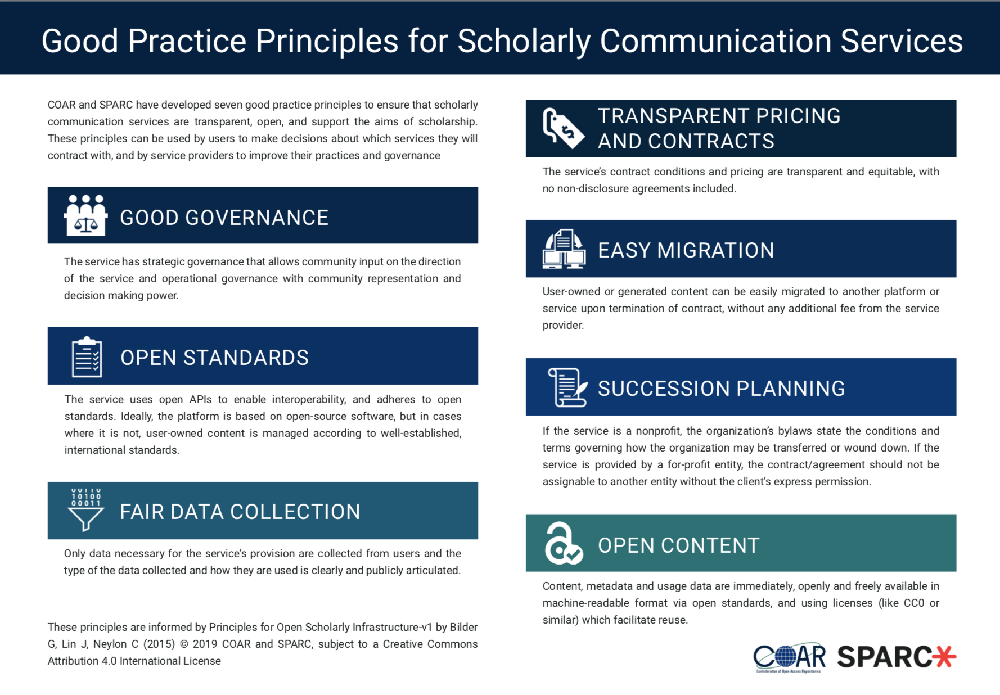
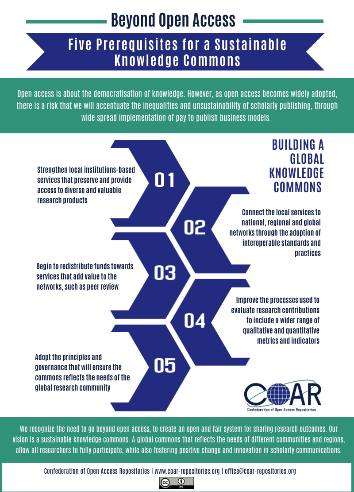

# Advocacy

## Building a Sustainable Knowledge Commons

Science and scholarship are critical to improving our lives and solving the world’s most intractable problems. The communication of research, a vital step in the research process, should be efficient, effective and fulfill the core values of scholarship. There is growing concern about the increasing concentration of control of research communication functions in the hands of a small number of players, whose objectives do not reflect the interests of scholarship.

\*\*\*\*[**Good Practice Principles for Scholarly Communication Services**](https://www.coar-repositories.org/files/COAR-SPARC-Good-Practice-Principles.pdf): COAR and SPARC have developed seven good practice principles for scholarly communication services with the aim to ensure that services are transparent, open, and support the aims of scholarship.

[**Five Prerequisites for a Sustainable Knowledge Commons**](https://www.coar-repositories.org/files/COAR-beyond-open-access-1.pdf): Open access is about the democratisation of knowledge. However, as open access becomes widely adopted, there is a risk that we will accentuate the inequalities and unsustainability of scholarly publishing, through wide spread implementation of pay to publish business models. At COAR, We recognize the need to go beyond open access, to create an open and fair system for sharing research outcomes. Our vision is a sustainable knowledge commons. A global commons that reflects the needs of different communities and regions, allow all researchers to fully participate, while also fostering positive change and innovation in scholarly communications. The graphic for the five prerequisities is also available in [Spanish](https://www.coar-repositories.org/files/COAR-beyond-open-access-esp.pdf) \([Más allá del Acceso Abierto](https://www.coar-repositories.org/files/COAR-beyond-open-access-esp.pdf)\).

## Other resources

* [Open Science and its advocacy](https://www.fosteropenscience.eu/content/open-science-and-its-advocacy) by FOSTER
* [European Open Access Champions](https://openscholarchampions.eu/openaccess/) by SPARC Europe
* [Open Science Roadmap](https://zenodo.org/record/1303002#.W310SS3MwUt) by LIBER
* PASTEUR4OA [Advocacy Resources](http://www.pasteur4oa.eu/resources)
* [Advocating for Open Access](http://blogs.ucl.ac.uk/open-access/files/2015/06/Advocacy-toolkit.pdf) by UCL & JISC 

