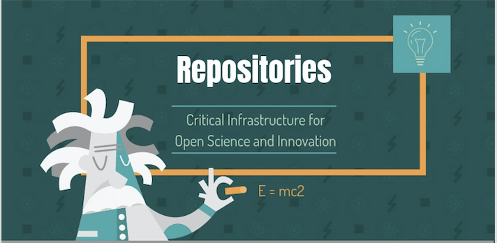

# Role of repositories

Together, repositories are the foundation for open science and open scholarship. While repositories can play a variety of roles, most importantly they collect, manage, preserve and provide access to valuable research and educational content.

Strengthening and maintaining the local management of content through repositories hosted at institutions and research organizations is important for several reasons. Large, centralized services and infrastructure may be easier to market and maintain, but they cannot be as responsive to a diversity of needs and priorities across regions and domains. In addition, local services can engage with the local researchers to help ensure that their outputs are being described and deposited correctly.

Eloy Rodrigues, Chairperson of COAR, explains below the role of repositories and how to leverage repositories to create more sustainable and innovative system for sharing and building on the results of research. This video is part of [Open Science MOOC](https://opensciencemooc.eu),  Module 6: Open Access to Research Papers.



In her keynote speech below at the 2018 RLUK Conference, Kathleen Shearer presents the current international context for scholarly communication, outline a vision for a more sustainable and equitable system for scholarly communication, and position open repositories within that environment.





