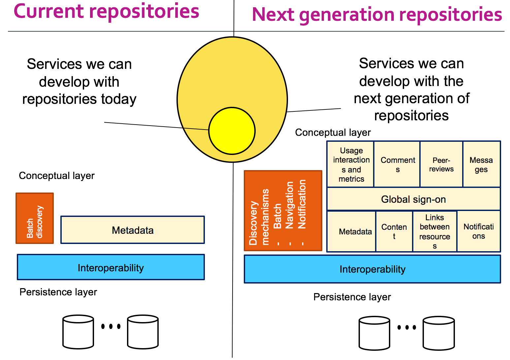

# Next generation repositories

## Rationale

The widespread deployment of repository systems in higher education and research institutions provides the foundation for a distributed, globally networked infrastructure for scholarly communication. However, repository platforms are still using technologies and protocols designed almost twenty years ago, before the boom of the Web and the dominance of Google, social networking, semantic web and ubiquitous mobile devices. This is, in large part, why repositories have not fully realized their potential and function mainly as passive recipients of the final versions of their users’ conventionally published research outputs. In order to leverage the value of the repository network, we need to equip it with a wider array of roles and functionalities, which can be enabled through new levels of web-centric interoperability.

Eloy Rodrigues presents "Introduction to Next Generation Repositories" at at COAR 2017 Annual Meeting, Italy. [Slides of the talk](http://doi.org/10.5281/zenodo.579976) are available on Zenodo. 



Paul Walk presents "What Does the Next Generation Repository Look Like" at COAR 2017 Annual Meeting, Italy. [Slides of the talk](http://doi.org/10.5281/zenodo.579982) are available on Zenodo. 



Andrea Bollini presents "Next Generation Repositories" at COAR 2018 Annual Meeting, Germany. [Slides of the talk](http://doi.org/10.5281/zenodo.1250154) are available on Zenodo. 



