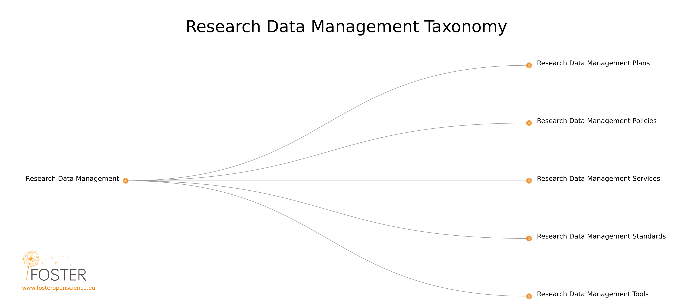

# Research data management

[Research Data Management taxonomy and relevant resources](https://www.fosteropenscience.eu/foster-taxonomy/research-data-management) by FOSTER 

"Research data management is part of the research process, aims to make the research process as efficient as possible and meet expectations and requirements of the university \(such as the requirements of the [TU Delft Research Data Framework Policy](https://d1rkab7tlqy5f1.cloudfront.net/Library/Themaportalen/RDM/researchdata-framework-policy.pdf)\), research funders, and legislation. By managing your data you will: 

* guarantee research integrity and replication.
* ensure that research data are authentic, complete, and reliable.
* minimize the risk of losing your data.
* increase research efficiency.
* prevent duplication of effort by enabling others to use your data.
* meet funding agency requirement." \([Why data management?](https://www.tudelft.nl/en/library/current-topics/research-data-management/research-data-management/why-data-management/) by TUDelft\)

Within the framework of the Danish National Forum for Data Management, the Danish Universities have developed the eLearning course “Research Data Management”. [eLearning course about the importance of good research data management ](https://vidensportal.deic.dk/en/RDMELearn)The course is divided into three independent modules. Each module consists of a 20 min video recording \(including animations and interviews\) that can be taken at the learners’ own pace and may be complemented with face-to-face training. The target audience of the course is PhD students, researchers and research support staff who would like an introduction to the general concepts and terms used in research data management.

## Resources in Other Languages





